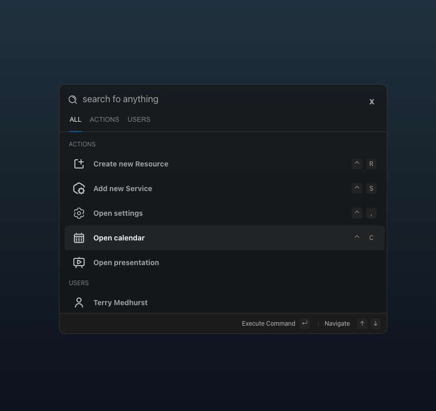

# CmdBarVue WIP



## Features

## Usage

### CmdBar
The `CmdBar` component is the main component of this library. It is used to display the command bar. It takes the following props:
- `commands`: An array of `Command` objects. (See [Commands](#commands))
- `visible`: Whether the command bar is visible or not. (Default: `false`)
- `loop`: Whether the command bar should loop through the commands or not. (Default: `false`)

And it takes 3 slots: `header`, `content` and `footer`.

Additionally, it exposes a `toogleCmdBar` method to toggle the visibility of the command bar. In combination with [useMagicKeys](https://vueuse.org/core/useMagicKeys/#usemagickeys), it can be used like this:
``` vue
import type { Commands } from '@/types'
import { useMagicKeys, whenever } from '@vueuse/core'

const cmdBar = ref<typeof CmdBar | null>(null)
const keys = useMagicKeys()
const cmdK = keys['Meta+k']

whenever(cmdK, () => {
  if (cmdBar.value) {
    cmdBar.value.toggleCmdBar()
  }
})
```

#### Commands
To add commands to the command bar, you can pass an array of `Command` objects to the component. A `Command` object has the following properties:
- `id`: The id of the command. This is used to identify the command when the user selects it. (This is made unique internally, so don't worry about that.)
- `leading`: The leading icon of the command. This is displayed in the command bar.
- `title`: The title of the command.
- `groups`: An array of groups the command belongs to. (Default: `[]`)
- `description`: The description of the command.
- `action`: The action of the command. This is called when the user selects the command.

Here is an example:
``` js
const items: Commands = [
  {
    id: '1',
    leading: './src/assets/icons/user.svg',
    title: 'Thomas Shelby',
    action: () => {
      alert('I need a cigarette')
    },
    actionClosesCmdBar: true,
    groups: ['ALL', 'User'],
    description: 'File operations'
  },
  {
    id: '2',
    leading: './src/assets/icons/settings.svg',
    title: 'Settings',
    action: () => {
      alert('Settings action triggered!')
    },
    actionClosesCmdBar: false,
    groups: ['ALL', 'Setting'],
    description: 'Settings operations'
  }
]
```
**Tip**: You can use the `Command` type to get autocompletion for the command object.


### CmdBarInput

### CmdBarFilter
Let you define filter options for the command bar. It takes the following props:
- `filterOptions`: An array of `FilterOption` objects.
- `defaultFilterOption`: The default filter option. (Default: `null`) | **Optional**
- `allowMultiSelect`: Whether the user can select multiple filter options or not. (Default: `true`) | **Optional**

#### FilterOptions
This should be a collection of all your groups that you have declared in your commands. 

#### DefaultFilterOption
This should be the group that you want to be selected by default.The behaviour of this prop is that it deselects all other `filterOptions` and selects **only** the one that you passed to the prop.
In this case (See [Commands](#commands)) I declared a group called "ALL" to all commands and I want it to be selected by default. So I pass it to the `defaultFilterOption` prop.

### CmdBarList
To ensure great performance and scalability, the `CmdBarList` component uses [useVirtualList](https://vueuse.org/core/useVirtualList/#usevirtuallist) under the hood, to render a virtualized list of commands. To work properly, it needs the **exact height** of a single item in the list. This has to be passed via the `itemHeight` prop.


## Misc

### Keybindings
You can pass a keybinding object to the component to add keybindings to the command bar. The keybinding object has to be of type `Keybindings` (string must be in lowercase). Here is an example:
``` vue
<CmdBarVue :keybindings="{ arrowUp: 'arrowup', arrowDown: 'arrowdown', enter: 'enter' }" />
```
**Tip**: You can use the `Keybindings` type to get autocompletion for the keybindings object.

